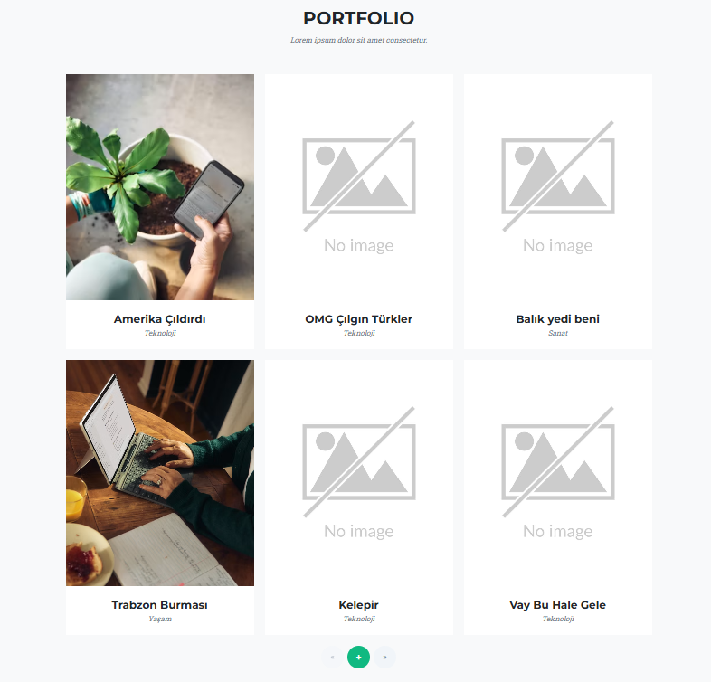
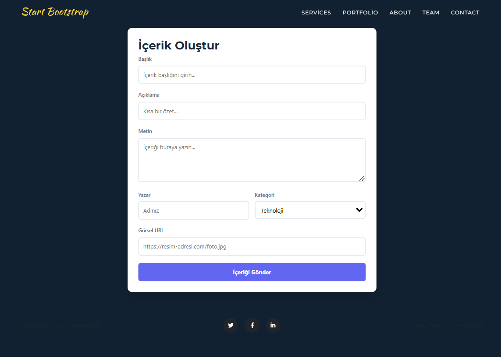
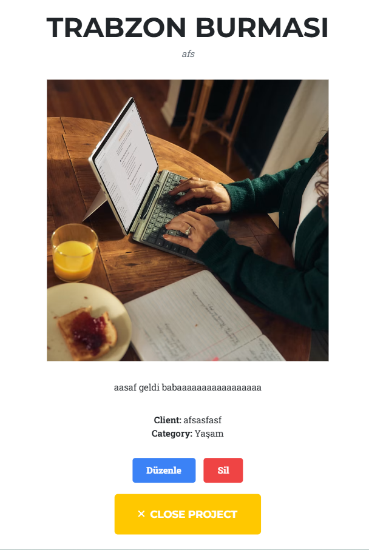

# Agency Portfolio Project

Bu proje, **Bootstrap** teması kullanılarak geliştirilmiş, MongoDB ve Node.js ile dinamik hale getirilmiş bir portföy uygulamasıdır.

## 🚀 Proje Hakkında
Bu uygulama ile portföy öğelerinizi dinamik olarak yönetebilir, ekleyebilir, güncelleyebilir ve silebilirsiniz (CRUD).

### 🛠 Kullanılan Teknolojiler
- **Backend:** Node.js, Express.js
- **Database:** MongoDB, Mongoose
- **Frontend:** EJS, Bootstrap

## 📂 Kurulum
1. `git clone https://github.com/SuleymanDD/Patika_Node.js.git`
2. `cd Agency_Project`
3. `npm install`
4. `.env` dosyasını oluşturup veritabanı ayarlarını yapın.
5. `npm run start` ile çalıştırın.

## ✨ Temel Özellikler
- Dinamik içerik yönetimi
- Modal üzerinden detaylı proje görüntüleme
- Dosya yükleme desteği
- CRUD operasyonları

## 📸 Ekran Görüntüleri

---
*Bu proje [StartBootstrap Agency](https://startbootstrap.com/theme/agency) teması kullanılarak geliştirilmiştir.*